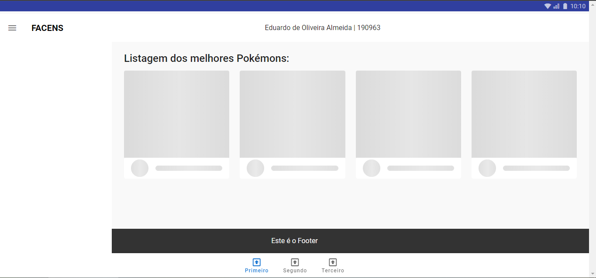
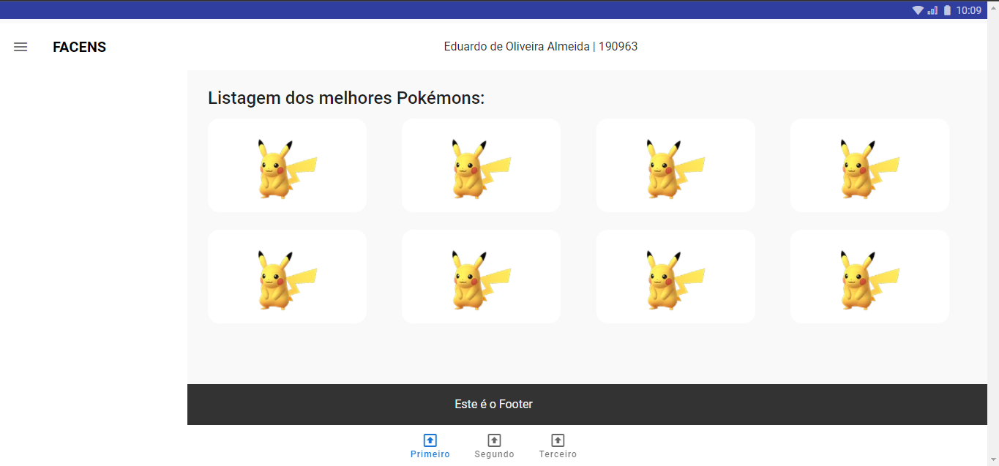

# Curso FACENS 6º Semestre

- Eduardo Almeida (190963)

## Project setup

```
npm install
```

### Compiles and hot-reloads for development

```
npm run serve
```

### Compiles and minifies for production

```
npm run build
```

### Lints and fixes files

```
npm run lint
```

## Prints

### Carregando Pokémon



### Pokémons Carregados

